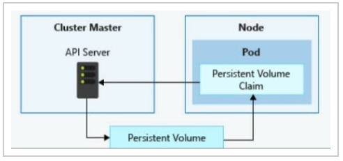

# [How to use volumes in Kubernetes](https://www.educative.io/answers/how-to-use-volumes-in-kubernetes)


## First problem
Let's say that we're deploying an Node.js application into k8s with the folllwing `deployment.yaml`  
```yaml
apiVersion: apps/v1 
kind: Deployment 
metadata:
  name: node-app-deployment
spec:
  replicas: 1 
  selector: 
    matchLabels: 
      anything: node-app 
  template: 
    metadata:
      labels:
        anything: node-app
    spec: 
      containers:
        - name: node-app-container 
          image: YourDockerHubName/node-image
```

Let's say there is one container inside a pod and this Node.js app stores some data. If we restart the container,   
all the stored data will be lost. Simple solution is adding `volumes` to our yaml file. Because even though, container is   
restarted in a pod, pod itself does not get restarted. For now, we take the simplest solution which is `emptyDir`.      

Now the `deployment.yaml` looks like this:  
```yaml
apiVersion: apps/v1 
kind: Deployment 
metadata:
  name: node-app-deployment
spec:
  replicas: 1 
  selector: 
    matchLabels: 
      anything: node-app 
  template: 
    metadata:
      labels:
        anything: node-app
    spec: 
      containers:
        - name: node-app-container 
          image: YourDockerHubName/node-image
          volumeMounts:
            - mountPath: /app/userData
              name: userData-volume       # same 
      volumes:
        - name: userData-volume           # same
          emptyDir: {}
```
First, we listed the volumes (that can be used by containers in `spec.containers`) under `spec.volumes`         
We have only one volume under  `spec.volumes` with volume type `emptyDir`. `emptyDir` can be configured  
with `sizeLimit` and `medium`:       
```yaml
    emptyDir:
      sizeLimit: 500Mi
      medium: "Memory"
```

Now this volume can be used by containers. For that, under `containers[i].volumeMounts`, `name` and `mountPath`  
should be specified. Anything is store  d in `/app/userData` folder of the container survives container restarts

## Second problem

Second problem arises when pod restarts. Data stored in `/app/userData` will be lost        
Any solution is to store the data on the node running our pod, assuming it is asingle node cluster.     
In this case, we can use `hostPath` type which allows us to set a path on the host machine and the data from that       
path will be exposed to different pods. 

`deployment.yaml` of the second problem:        
```yaml
apiVersion: apps/v1 
kind: Deployment 
metadata:
  name: node-app-deployment
spec:
  replicas: 1 
  selector: 
    matchLabels: 
      anything: node-app 
  template: 
    metadata:
      labels:
        anything: node-app
    spec: 
      containers:
        - name: node-app-container 
          image: YourDockerHubName/node-image
          volumeMounts:
            - mountPath: /app/userData
              name: userData-volume                # same
      volumes:
        - name: userData-volume                    # same
          hostPath:
            path: /data
            type: DirectoryOrCreate
```
Now, anything stored in `/app/userData`  of the container, stays in `/data` folder of    
the host machine, even the pods get deleted.

## Third problem

What if the our cluster has multiple nodes and our Node.js pods starts to run in different nodes?    
In this case, stored data will not be the same on each nodes. For this problem, we can use    
`Persistent Volume` or `PV`. Once we create a `PV` , it can be used by a pod irrespective of which node it    
runs on. 
PV usage steps:
  - First we create a `PV` (for ease of undertanding, let say a `PV` is a database)
  - (To use database, an app should make connection call to database connection address) To use `PV`, our app needs `PVC` (Persistent Volume Claim)


The following image should provide some clarity   



First, we create a `PV`:    
```yaml
apiVersion: v1 
kind: PersistentVolume
metadata:
  name: host-pv
spec: 
  capacity: 
    storage: 1Gi 
  volumeMode: Filesystem           # possible values Filesystem, Block
  storageClassName: standard       # explained later  
  accessModes:
    - ReadWriteOnce
  hostPath:
    path: /data
    type: DirectoryOrCreate
```

Now, we create a `PVC`:   
```yaml
apiVersion: v1
kind: PersistentVolumeClaim
metadata:
  name: host-pvc
spec: 
  volumeName: host-pv 
  accessModes: 
    - ReadWriteOnce
  storageClassName: standard
  resources: 
    requests: 
      storage: 1Gi
```

In the specification of PV Claim, we mention the PV name. And the final deployment file look like   
```yaml
apiVersion: apps/v1 
kind: Deployment 
metadata:
  name: node-app-deployment
spec:
  replicas: 1 
  selector: 
    matchLabels: 
      anything: node-app 
  template: 
    metadata:
      labels:
        anything: node-app
    spec: 
      containers:
        - name: node-app-container 
          image: YourDockerHubName/node-image
          volumeMounts:
            - mountPath: /app/userData
              name: userData-volume
      volumes:
        - name: userData-volume
          persistentVolumeClaim:
            claimName: host-pvc
```
In this `deployment.yaml` file, we used `persistentVolumeClaim` type with `claimName` being equal to  `host-pvc`:   


